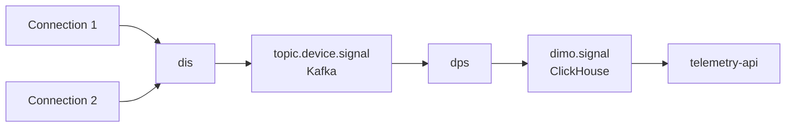

# Model Garage Developer Guide

Welcome to the Model Garage developer guide! This guide will help you understand the architecture of this repository and how to maintain and extend it.

## Table of Contents

- [What is Model Garage?](#what-is-model-garage)
- [Understanding Modules](#understanding-modules)
  - [What is a Module?](#what-is-a-module)
  - [Module Interfaces](#module-interfaces)
  - [How Modules are Registered](#how-modules-are-registered)
  - [Implementing a New Module](#implementing-a-new-module)
    - [Core Requirements](#core-requirements)
    - [Example Implementation](#example-implementation)
    - [Registration](#registration)
    - [Common Patterns (Optional)](#common-patterns-optional)
    - [Learn by Example](#learn-by-example)
  - [Updating an Existing Module](#updating-an-existing-module)
- [Code Generation](#code-generation)
  - [Overview](#overview)
  - [Module-Specific Code Generation](#module-specific-code-generation)
- [Adding New Signals](#adding-new-signals)
  - [Step 1: Update VSS CSV (if needed)](#step-1-update-vss-csv-if-needed)
  - [Step 2: Update Default Definitions](#step-2-update-default-definitions)
  - [Step 3: Update Module Definitions](#step-3-update-module-definitions)
  - [Step 4: Generate Code (if applicable)](#step-4-generate-code-if-applicable)
  - [Step 5: Implement Custom Conversion Logic (if needed)](#step-5-implement-custom-conversion-logic-if-needed)
  - [Step 6: Test Your Changes](#step-6-test-your-changes)
  - [Step 7: Propagate to Other Services](#step-7-propagate-to-other-services)
- [VSS Package - Signal and Event Structures](#vss-package---signal-and-event-structures)
  - [Signal Structure](#signal-structure)
  - [Event Structure](#event-structure)
  - [Using the Schema Package in Other Repos](#using-the-schema-package-in-other-repos)
    - [Getting All Default Signals](#getting-all-default-signals)
    - [Signal Information Available](#signal-information-available)
    - [Common Usage Patterns](#common-usage-patterns)
    - [Getting Event Tags](#getting-event-tags)
  - [When to Import This Package](#when-to-import-this-package)
- [Module-Specific Guides](#module-specific-guides)
- [Additional Resources](#additional-resources)
- [Where This Is Used](#where-this-is-used)

---

## What is Model Garage?

Model Garage is a Golang toolkit for managing and working with DIMO vehicle signal data. It provides:

1. **Signal Conversion**: Converting raw data from various hardware devices (AutoPi, Ruptela, Tesla, etc.) into standardized VSS (Vehicle Signal Specification) format
2. **Cloud Event Processing**: Transforming raw messages into CloudEvents for the DIMO data pipeline
3. **Modular Architecture**: A plugin-like system where each hardware provider has its own conversion module
4. **Code Generation**: Automatic generation of conversion functions from YAML definitions

---

## Understanding Modules

### What is a Module?

A **module** in Model Garage is a package that handles data conversion for a specific hardware provider or data source. Each module knows how to:

- Parse raw data from that specific provider
- Convert it to standardized VSS signals
- Generate CloudEvents with proper metadata
- Extract fingerprint data (like VIN)
- Handle provider-specific events

Current modules include:

- **AutoPi** - AutoPi hardware devices
- **Ruptela** - Ruptela hardware devices
- **Tesla** - Tesla API and telemetry data
- **HashDog** - HashDog (Macaron) hardware devices
- **DefaultModule** - Fallback for unknown sources

### Module Interfaces

Modules implement one or more of the following interfaces defined in `pkg/modules/modules.go`:

```go
// SignalModule - Convert raw data to VSS signals
type SignalModule interface {
    SignalConvert(ctx context.Context, event cloudevent.RawEvent) ([]vss.Signal, error)
}

// CloudEventModule - Convert raw data to CloudEvents
type CloudEventModule interface {
    CloudEventConvert(ctx context.Context, msgData []byte) ([]cloudevent.CloudEventHeader, []byte, error)
}

// FingerprintModule - Extract fingerprint data (VIN, etc.)
type FingerprintModule interface {
    FingerprintConvert(ctx context.Context, event cloudevent.RawEvent) (cloudevent.Fingerprint, error)
}

// EventModule - Convert raw data to vehicle events
type EventModule interface {
    EventConvert(ctx context.Context, event cloudevent.RawEvent) ([]vss.Event, error)
}
```

**Note**: A module does not need to implement all interfaces - only the ones relevant to its data source.

### How Modules are Registered

Modules are registered in `pkg/modules/register.go` during initialization. Each module is associated with an Ethereum address that identifies the hardware provider:

```go
// Example: Registering the Ruptela module
ruptelaModule := &ruptela.Module{}
signalReg.Override(RuptelaSource.String(), ruptelaModule)
cloudEventReg.Override(RuptelaSource.String(), ruptelaModule)
fingerprintReg.Override(RuptelaSource.String(), ruptelaModule)
eventReg.Override(RuptelaSource.String(), ruptelaModule)
```

There are four separate registries:

- `SignalRegistry` - For signal conversion
- `CloudEventRegistry` - For CloudEvent conversion
- `FingerprintRegistry` - For fingerprint extraction
- `EventRegistry` - For event conversion

### Implementing a New Module

A module is simply a Go type that implements one or more of the module interfaces. There's **no required file structure or naming convention** - organize your code however makes sense for your data source.

#### Core Requirements

The only requirements are:

1. **Implement the interfaces** - Your module must implement at least one of the four module interfaces
2. **Register your module** - Add it to the registries in `pkg/modules/register.go`
3. **Return valid data** - Ensure your conversions produce valid VSS signals/CloudEvents

#### Example Implementation

Here's a simple example of what a module might look like:

```go
package yourmodule

import (
    "context"
    "github.com/DIMO-Network/cloudevent"
    "github.com/DIMO-Network/model-garage/pkg/vss"
)

// Module can be any struct - use whatever fields you need
type Module struct {
    // Add any configuration your module needs
}

// Implement only the interfaces you need
func (*Module) SignalConvert(ctx context.Context, event cloudevent.RawEvent) ([]vss.Signal, error) {
    // Parse your provider's data format and convert to VSS signals
    // Implementation is entirely up to you
    return parseAndConvertSignals(event.Data)
}

func (*Module) CloudEventConvert(ctx context.Context, msgData []byte) ([]cloudevent.CloudEventHeader, []byte, error) {
    // Convert raw message to CloudEvent format
    // Implementation is entirely up to you
    return createCloudEvent(msgData)
}
```

#### Registration

To make your module available, register it in `pkg/modules/register.go`:

```go
import (
    "github.com/DIMO-Network/model-garage/pkg/yourmodule"
)

// Define the source address for your provider
var YourModuleSource = common.HexToAddress("0xYourEthereumAddressHere")

// In RegisterDefaultModules function, add:
yourModule := &yourmodule.Module{}
signalReg.Override(YourModuleSource.String(), yourModule)
cloudEventReg.Override(YourModuleSource.String(), yourModule)
// Register in other registries as needed
```

#### Common Patterns (Optional)

While not required, many modules follow these patterns:

**1. YAML Definitions + Code Generation**

Many modules use YAML files to define signal mappings and generate conversion code:

```
pkg/yourmodule/
├── schema/
│   └── yourmodule_definitions.yaml
└── codegen/
    └── convert_signal_status.tmpl
```

See the [Code Generation](#code-generation) section and existing modules like `pkg/ruptela/` for examples.

**2. Organized File Structure**

Modules often separate concerns into different files:

```
pkg/yourmodule/
├── module.go              # Interface implementations
├── convert_signal.go      # Signal conversion logic
├── convert_cloudevent.go  # CloudEvent conversion
└── module_test.go         # Tests
```

**3. Makefile Targets**

If using code generation, add a Make target:

```makefile
generate-yourmodule:
	go run ./cmd/codegen -convert.package=yourmodule \
	  -generators=convert \
	  -convert.output-file=./pkg/yourmodule/convert_signal_funcs_gen.go \
	  -definitions=./pkg/yourmodule/schema/yourmodule_definitions.yaml
```

#### Learn by Example

The best way to understand module implementation is to look at existing modules:

- **`pkg/autopi/`** - Straightforward example with YAML definitions
- **`pkg/ruptela/`** - Complex example with multiple data types and custom codegen
- **`pkg/defaultmodule/`** - Minimal example of a fallback module

Each module is implemented differently based on its needs!

### Updating an Existing Module

To update an existing module, the process depends on how the module is implemented:

**For modules using YAML definitions and code generation:**

1. **Add/modify signal mappings** in the module's definitions YAML file (e.g., `schema/modulename_definitions.yaml`)
2. **Run code generation**: `make generate-modulename` (e.g., `make generate-ruptela`)
3. **Implement custom conversion logic** if needed in the generated or custom files
4. **Update tests** to cover the new signals
5. **Test thoroughly** with real data from the provider

**For modules with custom implementations:**

1. **Modify the conversion logic** directly in the module's source files
2. **Update tests** to cover your changes
3. **Test thoroughly** with real data from the provider

The key is to understand how each module is structured - check the module's directory to see if it uses YAML definitions or custom logic.

---

## Code Generation

### Overview

Model Garage uses code generation extensively to reduce boilerplate and ensure consistency across modules. The code generation tool is located in `cmd/codegen/` and supports two main generators:

1. **Convert Generator** - Generates conversion function stubs for each signal mapping
2. **Custom Generator** - Executes custom Go templates for module-specific code

The codegen tool reads signal definitions from YAML files and generates Go code based on templates.

### Module-Specific Code Generation

Each module typically has its own code generation setup. The generated files follow a naming pattern:

- `convert_signal_funcs_gen.go` - Conversion function stubs (don't overwrite existing implementations)
- `convert_signal_status_gen.go` - Main conversion dispatcher (regenerated each time)
- `convert_signal_location_gen.go` - Location-specific conversions (some modules)

**Important**: The convert generator will NOT overwrite existing conversion functions. This allows you to implement custom logic for specific signals while still using generated stubs for new signals.

To regenerate code for all modules:

```bash
make generate
```

To regenerate code for a specific module:

```bash
make generate-ruptela    # or generate-autopi, generate-tesla, etc.
```

---

## Adding New Signals

When you need to add support for a new vehicle signal, follow these steps:

### Step 1: Update VSS CSV (if needed)

If the signal you're adding is **not already defined in the VSS (Vehicle Signal Specification) standard**, you need to add it to the DIMO VSS overlay first:

1. Go to the [DIMO VSS repository](https://github.com/DIMO-Network/VSS)
2. Follow the instructions in that repository to add your signal to `overlays/DIMO/dimo.vspec`
3. Once merged, update the VSS CSV in this repository: `pkg/schema/spec/vss_rel_4.2-DIMO-*.csv`

**Note**: If the signal already exists in the standard VSS specification, skip this step.

### Step 2: Update Default Definitions

The file `pkg/schema/spec/default-definitions.yaml` is the **master list** of all signals that are:

- Displayed in DIMO telemetry
- Available in the Vehicle Triggers API

Add your new signal to this file:

```yaml
- vspecName: Vehicle.YourNewSignal.Name
  requiredPrivileges:
    - VEHICLE_NON_LOCATION_DATA # or VEHICLE_ALL_TIME_LOCATION for location data
```

**Privilege Types**:

- `VEHICLE_NON_LOCATION_DATA` - For non-location signals (speed, temperature, etc.)
- `VEHICLE_ALL_TIME_LOCATION` - For location-based signals (GPS coordinates, heading, etc.)
- `VEHICLE_COMMANDS` - For command-related signals (rare)
- `VEHICLE_CURRENT_LOCATION` - For current location only (not historical)

### Step 3: Update Module Definitions

For **each module** that can provide this signal, you need to update the module to support it. The approach depends on how the module is implemented:

**For modules using YAML definitions** (like Ruptela, AutoPi, Tesla, etc.):

Edit the module's definitions file, e.g., `pkg/ruptela/schema/ruptela_definitions.yaml`:

```yaml
- vspecName: Vehicle.YourNewSignal.Name
  conversions:
    - originalName: "signals.123" # The field name/ID in Ruptela's data format
      originalType: string # Data type from the provider
  requiredPrivileges:
    - VEHICLE_NON_LOCATION_DATA
```

**Important Notes**:

- `vspecName` must match exactly what you put in `default-definitions.yaml`
- `originalName` is provider-specific (e.g., Ruptela uses numeric IDs like "signals.123")
- `originalType` describes the data type from the provider's payload
- `requiredPrivileges` should match the default definitions

**For modules with custom implementations**:

Directly modify the module's conversion logic to handle the new signal. Check the module's source code to understand how it processes signals.

Repeat this for any other modules that support this signal.

### Step 4: Generate Code (if applicable)

If you updated YAML definition files, regenerate the conversion functions:

```bash
# Regenerate for specific module
make generate-ruptela

# Or regenerate everything
make generate
```

This will:

1. Generate conversion function stubs if they don't exist
2. Update the main conversion dispatcher
3. Wire up the new signals in the module's conversion logic

### Step 5: Implement Custom Conversion Logic (if needed)

If the signal requires special processing (unit conversion, data transformation, etc.), implement the conversion function manually:

In the generated `convert_signal_funcs_gen.go`, find your function stub and add custom logic:

```go
func convertYourNewSignal(value string) (float64, error) {
    // Add your custom conversion logic here
    // Example: convert from string to float with validation
    val, err := strconv.ParseFloat(value, 64)
    if err != nil {
        return 0, fmt.Errorf("invalid value: %w", err)
    }
    // Apply any unit conversions, validations, etc.
    return val, nil
}
```

### Step 6: Test Your Changes

1. Write tests in `module_test.go` and `convert_signal_test.go`
2. Run tests: `make test`
3. Test with real data from the hardware provider if possible

### Step 7: Propagate to Other Services

Once your changes are merged and released in model-garage, update the model-garage version in the following services go.mod:

1. **dis** - this will make sure the signal gets converted and stored in the database.
2. **telemetry-api** - This will make sure the signal is available in the API.
3. **vehicle-triggers-api** - This will make sure the signal can be used in webhooks.

---

## VSS Package - Signal and Event Structures

The `pkg/vss` package defines the core data structures for signals and events in DIMO. These structures map directly to how data is stored in the database (ClickHouse).

### Signal Structure

The `vss.Signal` struct represents a single vehicle signal measurement and **directly corresponds to the database schema**:

```go
type Signal struct {
    TokenID       uint32        // Vehicle token ID
    Timestamp     time.Time     // When the data was collected
    Name          string        // VSS signal name (e.g., "Vehicle.Speed")
    ValueNumber   float64       // Numeric value
    ValueString   string        // String value
    ValueLocation Location      // GPS coordinates (lat, lon, HDOP)
    Source        string        // Data source (e.g., integration ID)
    Producer      string        // Device that produced the data
    CloudEventID  string        // CloudEvent identifier
}
```

**Database Mapping**:

- Each field maps to a column in the ClickHouse `signal` table
- The table name constant is `vss.TableName` (`"signal"`)
- Column names are available as constants (e.g., `vss.NameCol`, `vss.ValueNumberCol`)

**Value Types**:
Signals support three value types:

- **`ValueNumber`** - For numeric data (speeds, temperatures, battery levels, etc.)
- **`ValueString`** - For text data (fuel types, states, VINs, etc.)
- **`ValueLocation`** - For GPS coordinates with optional HDOP

The `SetValue()` method automatically sets the correct value field based on the data type:

```go
signal := vss.Signal{Name: "Vehicle.Speed"}
signal.SetValue(65.5) // Sets ValueNumber
```

**Helper Functions**:

- `vss.SignalToSlice(signal)` - Converts a signal to an array for ClickHouse batch insertion
- `vss.SignalColNames()` - Returns column names in the correct order for inserts

### Event Structure

The `vss.Event` struct represents vehicle events (harsh braking, collisions, etc.) and **directly corresponds to the database schema**:

```go
type Event struct {
    Subject      string      // Vehicle/entity DID
    Source       string      // Integration source
    Producer     string      // Device DID
    CloudEventID string      // CloudEvent identifier
    Name         string      // Event name (e.g., "behavior.harshBraking")
    Timestamp    time.Time   // When the event occurred
    DurationNs   uint64      // Event duration in nanoseconds
    Metadata     string      // JSON metadata
    Tags         []string    // Event tags
}
```

**Database Mapping**:

- Each field maps to a column in the ClickHouse `event` table
- The table name constant is `vss.EventTableName` (`"event"`)
- Column names are available as constants (e.g., `vss.EventNameCol`, `vss.EventTimestampCol`)

**Helper Functions**:

- `vss.EventToSlice(event)` - Converts an event to an array for ClickHouse batch insertion
- `vss.EventColNames()` - Returns column names in the correct order for inserts

### Using the Schema Package in Other Repos

The `pkg/schema` package provides utilities for working with signal definitions. This is commonly used by other DIMO services that need to:

- Get a list of all available signals
- Look up signal metadata (descriptions, units, data types)
- Validate signal names
- Generate API schemas

#### Getting All Default Signals

The most common use case is getting the complete list of signals defined in `default-definitions.yaml`:

```go
import "github.com/DIMO-Network/model-garage/pkg/schema"

// Get all signals with their definitions
signals, err := schema.GetDefaultSignals()
if err != nil {
    return fmt.Errorf("failed to load signals: %w", err)
}

// Iterate through signals
for _, sig := range signals {
    fmt.Printf("Signal: %s\n", sig.Name)          // e.g., "Vehicle.Speed"
    fmt.Printf("Description: %s\n", sig.Desc)     // Human-readable description
    fmt.Printf("Unit: %s\n", sig.Unit)            // e.g., "km/h"
    fmt.Printf("Type: %s\n", sig.GOType())        // e.g., "float64"
    fmt.Printf("Privileges: %v\n", sig.Privileges) // Required permissions
}
```

#### Signal Information Available

Each `schema.SignalInfo` provides:

**From VSS Specification:**

- `Name` - Full VSS name (e.g., `"Vehicle.Powertrain.CombustionEngine.Speed"`)
- `Desc` - Human-readable description
- `Unit` - Unit of measurement (e.g., `"rpm"`, `"km/h"`, `"celsius"`)
- `DataType` - VSS data type (e.g., `"uint16"`, `"float"`, `"string"`)
- `Min`, `Max` - Valid value ranges (if defined)
- `Type` - Signal type (e.g., `"sensor"`, `"actuator"`)
- `Deprecated` - Whether the signal is deprecated

**Derived Fields:**

- `GOName` - Go-friendly name (e.g., `"PowertrainCombustionEngineSpeed"`)
- `JSONName` - JSON-friendly name (e.g., `"powertrainCombustionEngineSpeed"`)
- `GOType()` - Go type (`"float64"`, `"string"`, or `"vss.Location"`)

**From Definitions:**

- `Privileges` - Required permissions to access (e.g., `["VEHICLE_NON_LOCATION_DATA"]`)
- `Conversions` - How modules convert this signal from raw data

#### Common Usage Patterns

**Example 1: API Schema Generation**

```go
// telemetry-api uses this to generate GraphQL schemas
signals, err := schema.GetDefaultSignals()
for _, sig := range signals {
    // Generate GraphQL field
    field := fmt.Sprintf("%s: %s", sig.JSONName, sig.GQLType())
}
```

**Example 2: Validation**

```go
// Validate if a signal name is supported
signals, _ := schema.GetDefaultSignals()
signalMap := make(map[string]*schema.SignalInfo)
for _, sig := range signals {
    signalMap[sig.Name] = sig
}

if info, exists := signalMap["Vehicle.Speed"]; exists {
    fmt.Printf("Signal exists: %s\n", info.Desc)
}
```

**Example 3: Permission Checking**

```go
// vehicle-triggers-api checks signal permissions
signal := signalMap["Vehicle.CurrentLocation.Latitude"]
if containsPrivilege(signal.Privileges, "VEHICLE_ALL_TIME_LOCATION") {
    // Signal requires location permissions
}
```

#### Getting Event Tags

Similarly, you can get all defined event tags:

```go
import "github.com/DIMO-Network/model-garage/pkg/schema"

eventTags, err := schema.GetDefaultEventTags()
if err != nil {
    return fmt.Errorf("failed to load event tags: %w", err)
}

for _, tag := range eventTags {
    fmt.Printf("Event: %s - %s\n", tag.Name, tag.Desc)
}
```

### When to Import This Package

Import `pkg/vss` when you need to:

- **Work with signal/event data structures** for database operations
- **Create or parse signals/events** in your service

Import `pkg/schema` when you need to:

- **Get metadata about available signals** (descriptions, units, types)
- **Generate API schemas** from signal definitions
- **Validate signal names** against the specification
- **Check permissions** required for signals

---

## Module-Specific Guides

For detailed information about each module's implementation, see:

- [Default Module Guide](./pkg/defaultmodule/DEFAULTMODULE.md)
- [AutoPi Module Guide](./pkg/autopi/AUTOPI.md)
- [Ruptela Module Guide](./pkg/ruptela/RUPTELA.md)
- [Tesla Module Guide](./pkg/tesla/TESLA.md)
- [HashDog Module Guide](./pkg/hashdog/HASHDOG.md)

---

## Additional Resources

- [Model Garage README](./README.md) - Overview and basic usage
- [Signal Definitions Spec](./pkg/schema/spec/spec.md) - VSS signal documentation
- [DIMO VSS Repository](https://github.com/DIMO-Network/VSS) - VSS specification overlays

## Where This Is Used

You could call this a circular reference.



[dis](https://github.com/DIMO-Network/dis) determines a connection address from the certificate used in the request made by the connection. It uses that to look up a model-garage module. Part of what the module does is extract [`vss.Signal`](pkg/vss/signal.go) structs from the request, serialize them as JSON objects, and send them one by one onto `topic.device.signal`.

[dps](https://github.com/DIMO-Network/dps) reads these messages, uses model-garage to them into tuples that exactly match the `dimo.signal` schema, and inserts them into ClickHouse with some buffering. dps is also responsible for running the migrations in this repository.

[telemetry](https://github.com/DIMO-Network/telemetry-api) relies on model-garage for a lot of things:

1. Knowing the field names and types, for `.graphql` code generation.
2. Knowing the names of database tables and columns in order to construct queries.
